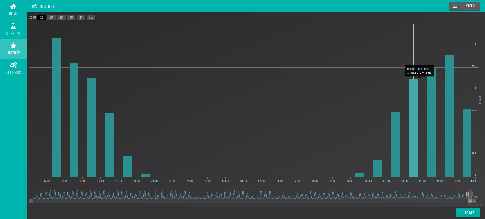
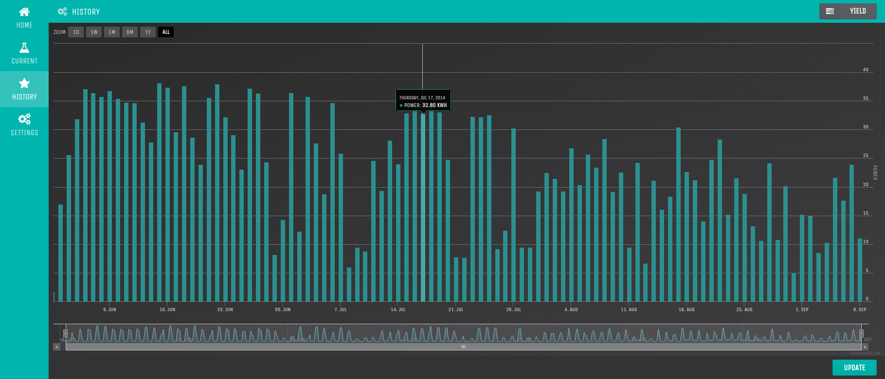
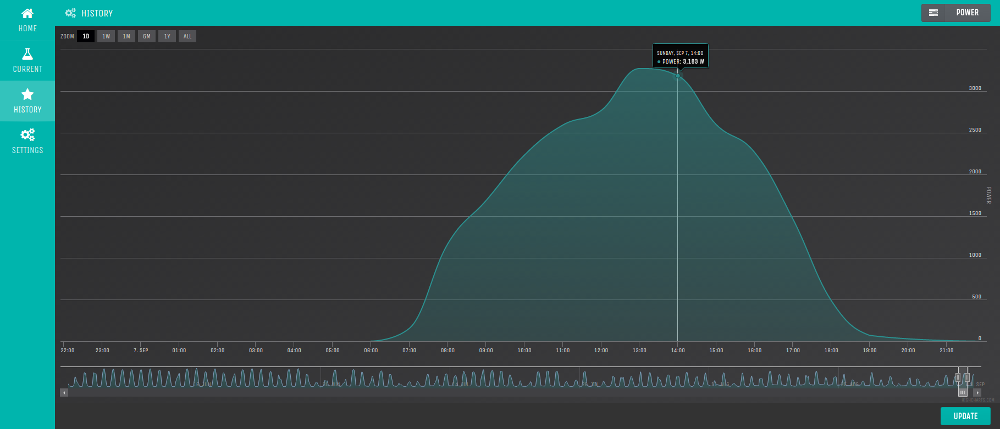

python-piko
===========

Python library to connect to KOSTAL PIKO inverters and web monitor.

### Usage

    import piko

    # Create to PIKO inverter device (ip, port, address).
    inverter = piko.Device('192.168.178.10', 81, 255)
    # Connect to device.
    inverter.connect()

    # Update inverter data.
    inverter.update()
    # Print latest inverter data.
    print inverter.data

    # Disconnect from inverter.
    inverter.disconnect()

### Monitor (in progress)

